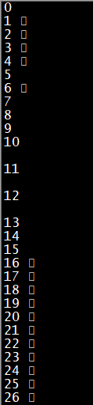

# Cout引发的一个BUG

## 问题背景

从前几个月开始，我们的TestClient里对协议的打印经常会出现乱码，然后就导致整个shell都乱码了，之前一直没时间查原因。前几天实在忍不了了，然后就去研究了一下。

## 问题研究

最初我跟同事都以为是消息体里有中文，导致输出到shell上的时候乱码了。但是按照网上方法配置了很久之后，乱码依旧。同时去看了下输出到log的消息，发现shell上乱码的协议在log里既没有乱码也没有中文。

迫不得已，只好对出现乱码的协议进行“折半Debug”，最后发现出问题的是对一个uint8变量的输出，我们输出到log是用的协议系统自带的函数拼接的字符串，而TestClient为了查看方便，还对这个标记msgid的变量用cout额外输出了一次。

由于我们的uint8其实是unsigned char的别名，因此此时输出的是一个unsigned char而不是一个uint，而unsigned char的某几个值的确是可能输出乱码的。

验证如下:
```cpp
int main()
{
    unsigned char x;
    for (int i = 0; i < 128; i++)
    {
        x = i;
        std::cout << i << " " << x << std::endl;
    }
    return 0;
}
```


这个问题最初没有暴露，是因为一开始msgid定义用的是uint16，后来为了节约带宽，我们改成了uint8。

由此，我觉得是不是应该尽量少用stream，至少是标准库的stream来做输出，因为它们对于8位整型的输出可能是与预期不符合的（虽然这种不符合是来自于我们混用了8位整型跟字符类型，但是C++/C确实也不提供独立的8位整型），而我们在迭代过程中又不可避免的经常将一些16位/32位整型修改为8位，导致一些结果前后不一致。