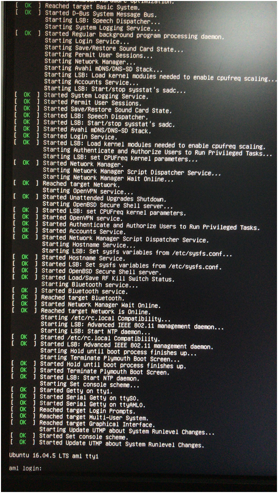

# 斐讯N1刷armbian最简操作


## 前言

最近买了台 [SolidRun CuBox i4p][1]，被顾QQ批评为"太贵了"。他最近正好在刷 N1盒子，[闲鱼][2]上75块包邮，性价比超高。听罢，我也在[闲鱼][2]上弄了台N1。

这篇是顾QQ刷N1盒子的记录。等我的N1盒子到货，准备刷个 OpenBSD 玩玩。

斐讯这公司已经倒闭了。


## 准备工具

 * N1 一台
 * USB 双公口线一条
 * 4G 以上 U 盘一个，新 U 盘可能有兼容性问题（最好是USB2.0设备或SD卡加读卡器）
 * 可以运行安卓adb工具的电脑一台，win/mac/linux都行


## 降级 bootloader（fastboot）

首先下载文件 

 * 微云：[https://share.weiyun.com/5vAkZ7p][3] 密码：nzwy53

将N1接上网线，HDMI线接显示器，离HDMI口远的那个USB口接一个鼠标。连上网以后，等个五分钟左右，待其自动升级到最新版，中间可能会多次重启升级，直到不再升级为准。否则如果正在刷的过程中N1重启可能会有点麻烦。

接下来用鼠标点击屏幕上版本号的地方4次，屏幕中间会显示一下“开启adb”。


将 N1 上距离 HDMI 口近的那个 USB 口和电脑之间用 USB 双公头线连接，并让电脑和N1处于同一局域网下，首先执行

```
adb connect <N1的IP地址，可以在N1屏幕上看到>
adb shell reboot fastboot
```

此时应该可以看到N1重启黑屏，接下来在电脑上执行

```
fastboot devices
```

如果能够显示出一行设备信息，说明 USB 连接正常，将最开始下载的文件包中 boot.img bootloader.img recovery.img 三个文件放在当前目录下，并执行

```
fastboot flash bootloader bootloader.img
fastboot flash boot boot.img
fastboot flash recovery recovery.img
fastboot reboot
```

如此便完成了bootloader 降级。


## 降级 bootloader（adb）

1. 盒子插网线接入和电脑同一局域网，记下盒子获得的内网IP地址；
2. N1在主界面使用鼠标点击四次固件版本号打开adb
3. 下载一键降级包：[https://share.weiyun.com/5klmuxd][4]，密码：yaefa9
4. 根据提示操作


## 制作Armbian启动盘

首先从 [https://yadi.sk/d/pHxaRAs-tZiei][5] 下载最新的版本，因为我最后还是要刷成 CentOS，所以下个最小的就行，比如 Debian 不带 desktop 的版本。将 .xz 文件解开以后是个 .img 文件。将这个文件用 [Win32DiskImager][6] 或者 USB Image Tool ，或者在 linux 下 dd 直接写入 U 盘。

接下来打开第一个分区，在 Windows 上面应该是一个 BOOT 分区，下载 

 * [https://github.com/yangxuan8282/phicomm-n1/releases/download/dtb/meson-gxl-s905d-phicomm-n1.dtb][7]

这个文件到 dtb 目录下， 用文本编辑器编辑根目录下面的 uEnv.ini ，将里面 dtb 一行替换成这个文件的名字并保存，Armbian 启动 U 盘就做好了


## 刷入Armbian系统

N1的两个 USB 口，离HDMI口远的接 U 盘，另一个接 USB 键盘。HDMI 线接显示器，加电启动。屏幕会先出现启动画面，之后会进入U盘armbian启动界面。

这里如果多次重复，还是无法进入Linux系统，那么请换个 U 盘再试，基本这里不成功都是因为 U 盘兼容性问题导致的。最好是 USB 2.0 的 U 盘。

进入 Armbian 以后用 root:1234 登录，会被要求修改密码和创建普通用户。完成以后会留在一个 root shell 里面。下面执行

```
./install.sh
```

完成以后，断电，拔掉 U 盘重启，应该就可以看到 Armbian 系统启动了。




## 硬件参数

 * CPU: Amlogic S905D
 * RAM: 2G DDR3
 * 8G eMMC
 * Ethernet: RTL8211F Gigabit Ethernet
 * WIFI/Bluetooth: ? CYW43455 ( same as Raspberry Pi 3B+ ) 5G WiFi IEEE 802.11n/ac with Integrated Bluetooth 4.1 [Datasheet]

对比了下，和 [CuBox i4p][1] 差不多。75块这个价格，真是便宜。其中，[eMMC][11] 就是硬盘。


## 耗电计算

 * 电压/电流：12V 2A
 * 功耗：12*2 = 24W
 * 1度电：1000W/小时
 * 每月耗电：(24*30) / (1000/24) = 17.3 度
 * 电费单价：南方电网，第一档 0.59/度；第二档，0.64/度
 * 每月电费：0.64*17.3 = 11.07 元

夏天24小时开机，一个月11块，还能接受。


## 参考资料

 * [https://www.right.com.cn/forum/thread-340279-1-1.html][8]
 * [https://www.right.com.cn/forum/thread-322223-1-1.html][9]


[1]:https://www.solid-run.com/product/SRMX6QDWT1D02GE008X00CE/
[2]:https://2.taobao.com/
[3]:https://share.weiyun.com/5vAkZ7p
[4]:https://share.weiyun.com/5klmuxd
[5]:https://yadi.sk/d/pHxaRAs-tZiei
[6]:https://sourceforge.net/projects/win32diskimager/
[7]:https://github.com/yangxuan8282/phicomm-n1/releases/download/dtb/meson-gxl-s905d-phicomm-n1.dtb
[8]:https://www.right.com.cn/forum/thread-340279-1-1.html
[9]:https://www.right.com.cn/forum/thread-322223-1-1.html
[10]:http://www.cypress.com/documentation/datasheets/cyw43455-single-chip-5g-wifi-ieee-80211nac-macbaseband-radio-integrated
[11]:https://www.kingston.com/en/embedded/eMMC