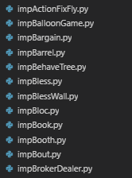

# [SAP01] Entity-Component System

ECS（Entity-Component System）的概念，随着 Unity3d 在游戏圈里，变得很流行。其实这个模式，早就被用于各大系统的设计。

其实我更愿意把这个 Pattern 称为 [Actor Model][1]。最早是从 erlang 中听来的。基本思想：

 * 功能切分（Module / Actor / Task / Process / Thread 都是功能切分的方式）
 * 功能之间的通讯，通过 message-passing 来互相通讯。function call 本身，就是同步 message-passing。

看了这么多代码，发现按照 Actor Model 设计的系统，可以保持很好的扩展性。

不空谈理论，来看看现实世界中，有哪些优秀的设计。


## uC/OS-II 中的 Task

uC/OS-II 本身是一个嵌入式的 Kernel，支持抢占式的 Task 调度。


然后它周围的功能模块（KEY / CLK / TMR 等等），都是独立的 Task。


模块之间如果有通讯需求，uC/OS-II 提供了 MailBox 这种 message-queue 机制。

TMR 是个 timer 模块，管理一堆 timer func，时间到了就 call 一下。

TMR 模块启动

```C
void TmrInit(void)
{
    ...
    OSTaskCreate(TmrTask, (void *)0, &TmrTaskStk[TMR_TASK_STK_SIZE], TMR_TASK_PRIO);
}
```

TMR 主循环

```C
static void TmrTask(void *data)
{
    ...

    for (;;) {

        OSTimeDlyHMSM(0, 0, 0, 100);  /* Delay for 1/10 second (Task context-switch) */

        ...                           /* Trigger timer callback                      */
    }
}
```


## 操作系统的 Process

通用操作系统中的进程（Process），就是一个 Actor。然后进程之间，可以通过操作系统提供的 Inter-Process Communication API 来互相通讯，共同完成一个业务。

TCP/IP 就是这种 API。当然，TCP 可以跨 machine。


## erlang 中的 LWP(light-weight process)

erlang 整个设计，和操作系统很像，process 可以自由创建/销毁。(动态的业务逻辑创建、销毁能力)

myworker.erl，一个简单的模块，接收消息，然后 print 一些内容。

```erlang
-module(myworker).
-export([loop/0]).

loop() ->
    receive
        {foo, Val} ->
            io:format("foo = ~p~n", [Val]);
        {bar, Val} ->
            io:format("bar = ~p~n", [Val])
    end,
    loop().
```

运行看看

```
1> c(myworker).
{ok,myworker}

2> Pid = spawn(myworker, loop, []).
<0.38.0>

3> Pid ! {foo, "hello"}.
foo = "hello"
{foo,"hello"}

4> Pid ! {bar, a_atom}.
bar = a_atom
{bar,a_atom}

5> Pid ! {no_this}.      
{no_this}
```


## Win32 中窗体的 message-queue

写过 Win32 API 程序的同学，都应该对 Win32 message-queue 很熟悉。

在 Windows 上，进程中的**每条线程(Thread)**都会有自己的 message-queue。通过 [GetMessage()][6] 从 message-queue 中获取消息，然后处理业务。

线程之间、进程之间，可以通过

 * [SendMessage()][4]，给窗体发消息
 * [PostThreadMessage()][5]，给某条线程发消息

注意，窗体消息是发送给"其所依附的线程的 message-queue"中的。

```C
#include <windows.h>

LRESULT CALLBACK WndProc(HWND, UINT, WPARAM, LPARAM);

int WINAPI WinMain(HINSTANCE hInstance, HINSTANCE hPrevInstance,
                   PSTR szCmdLine, int iCmdShow)
{
    ...

    while (GetMessage(&msg, NULL, 0, 0))
    {
        TranslateMessage(&msg);
        DispatchMessage(&msg);
    }
    return msg.wParam;
}
```

[GetMessage()][6] 中的第一个参数 hWnd，来决定是获取窗体的消息，还是线程的消息。如果 hWnd == NULL，则窗体消息、线程消息都会处理，这就保证如上的一个 while 循环，可以处理所有的消息。

```
A handle to the window whose messages are to be retrieved. The window must
belong to the current thread.

If hWnd is NULL, GetMessage retrieves messages for any window that belongs
to the current thread, and any messages on the current thread's message queue
whosehwnd value is NULL (see the MSG structure). Therefore if hWnd is NULL,
both window messages and thread messages are processed.

If hWnd is -1, GetMessage retrieves only messages on the current thread's
message queue whose hwnd value is NULL, that is, thread messages as posted
by PostMessage (when the hWnd parameter is NULL) or PostThreadMessage.
```


## DOOM3 中的 GameSystem

[GameSystem][7]，DOOM3 用于写游戏逻辑的一个基础模块，可以让每个 C++ 的类，变成一个 entity。entity 之间，通过互相发送消息来通讯。

游戏中，会有很多 NPC 和 Monster 之类的 entity，需要创建、删除，entity 本身会有受到攻击、攻击别人 等等行为。切分为 entity，逻辑上会很清晰。

idClass + idEventDef + idEvent，形成了一套 idClass 之间可以互相发消息的结构。很巧妙，不需要任何 template，代码结构也简单。

 * idEventDef，定义了 event 参数类型
 * idEvent，保存每个 event 的实际参数

看看 idClass 自带的两个 Event：

```C
const idEventDef EV_Remove( "<immediateremove>", NULL );
const idEventDef EV_SafeRemove( "remove", NULL );

ABSTRACT_DECLARATION( NULL, idClass )
  EVENT( EV_Remove       idClass::Event_Remove )
  EVENT( EV_SafeRemove,  idClass::Event_SafeRemove )
END_CLASS
```

触发 Event

```
PostEventMS( &EV_Remove, 0 );   // 0 ms 之后，调用 idClass::Event_Remove
```


## Unity3d 中的 ECS（Entity-Component System）

上面更多的在谈到 entity，以及 entity 之间互相发消息。

如果一个 entity 本身就很复杂，可以将其每个子模块，独立为一个 component，代码逻辑分开。Unity3d 中的每一个 entity 就是如此。

```C
class MoveComponent;
class RenderComponent;
class PhysicsComponent;
...

class Player {
    MoveComponent;
	RenderComponent;
	...
};

class PhysicsMonster {
	MoveComponent;
	RenderComponent;
    PhysicsComponent;
	...
};
```

我们项目中的代码也一样，对于 Player 的所有功能模块，都才分到不同的 component 中，划分在不同的代码文件上。



抽象了看，ECS，不过是两层的 Actor Model：

 * entity 之间是一层
 * entity 内部的 component 之间是一层


## Task + Scheduler 在游戏引擎中的应用

对于 3D 客户端引擎，其内部每一帧，都会出现很多业务：

 * 游戏玩法运算
 * 物理运算
 * 动画运算
 * 裁剪、准备绘制内容
 * 等等，其实都是不同的业务

这些业务，是否可以切分为可以并行的 Task，然后丢到 Thread Pool 中并发执行，以榨取 CPU multi-core 的最大性能。

Task + Scheduler 在游戏引擎中的应用，出于顽皮狗(神秘海域了解下 :-)的GDC演讲《[Parallelizing the Naughty Dog Engine Using Fibers][8]》。

[Skyforge][9] 的程序员，将这套系统实现了，开源在[这里][10]，支持 PC、PS4。

我司的M记引擎，用的 [boost.asio][11] strand，也做了类似的系统，支持所有 mobile platform。

Task + Scheduler，本质上也是一种 Entity System。**有没有发现，一个软件做到极致，就是在做操作系统。**:-)


## 后记

这篇文章的灵感，来源于和 [fatfatson][3] 讨论我的一篇文章《[C++, Farewell~][2]》。本来是讨论 C++ 的缺点的，然后讨论到 ECS。

[1]:https://en.wikipedia.org/wiki/Actor_model
[2]:https://github.com/kasicass/blog/blob/master/cpp/2018_11_23_farewell_cpp.md
[3]:https://fatfatson.github.io/
[4]:https://docs.microsoft.com/en-us/windows/desktop/api/winuser/nf-winuser-sendmessage
[5]:https://docs.microsoft.com/en-us/windows/desktop/api/winuser/nf-winuser-postthreadmessagea
[6]:https://docs.microsoft.com/en-us/windows/desktop/api/winuser/nf-winuser-getmessage
[7]:https://github.com/TTimo/doom3.gpl/tree/master/neo/game/gamesys
[8]:http://www.swedishcoding.com/wp-content/uploads/2015/03/parallelizing_the_naughty_dog_engine_using_fibers.pdf
[9]:https://sf.my.com/us
[10]:https://github.com/SergeyMakeev/TaskScheduler
[11]:https://www.boost.org/doc/libs/1_68_0/doc/html/boost_asio.html
